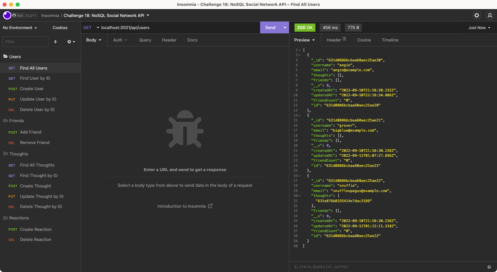

# Challenge 18 - NoSQL Social Network API

## Table of Contents

- [Overview](#overview)
  - [The Challenge](#the-challenge)
  - [User Story](#user-story)
  - [Acceptance Criteria](#acceptance-criteria)
  - [Screenshot](#screenshot)
  - [Links](#links)
- [My Process](#my-process)
  - [Built With](#built-with)
  - [What I Learned](#what-i-learned)
  - [Continued Development](#continued-development)
  - [Useful Resources](#useful-resources)
- [Author](#author)
- [Acknowledgments](#acknowledgments)

## Overview

### The Challenge

> MongoDB is a popular choice for many social networks due to its speed with large amounts of data and flexibility with unstructured data. Over the last part of this course, you’ll use several of the technologies that social networking platforms use in their full-stack applications. Because the foundation of these applications is data, it’s important that you understand how to build and structure the API first.
>
> Your Challenge is to build an API for a social network web application where users can share their thoughts, react to friends’ thoughts, and create a friend list. You’ll use Express.js for routing, a MongoDB database, and the Mongoose ODM. In addition to using the [Express.js](https://www.npmjs.com/package/express) and [Mongoose](https://www.npmjs.com/package/mongoose) packages, you may also optionally use a JavaScript date library of your choice or the native JavaScript `Date` object to format timestamps.
>
>No seed data is provided, so you’ll need to create your own data using Insomnia after you’ve created your API.
>
>Because this application won’t be deployed, you’ll also need to create a walkthrough video that demonstrates its functionality and all of the following acceptance criteria being met. You’ll need to submit a link to the video and add it to the README of your project.

### User Story

```md
AS A social media startup
I WANT an API for my social network that uses a NoSQL database
SO THAT my website can handle large amounts of unstructured data
```

### Acceptance Criteria

```md
GIVEN a social network API
WHEN I enter the command to invoke the application
THEN my server is started and the Mongoose models are synced to the MongoDB database
WHEN I open API GET routes in Insomnia for users and thoughts
THEN the data for each of these routes is displayed in a formatted JSON
WHEN I test API POST, PUT, and DELETE routes in Insomnia
THEN I am able to successfully create, update, and delete users and thoughts in my database
WHEN I test API POST and DELETE routes in Insomnia
THEN I am able to successfully create and delete reactions to thoughts and add and remove friends to a user’s friend list
```

### Screenshot



https://user-images.githubusercontent.com/103882157/189562028-08f14ffa-4a02-4546-8c32-a285088ece38.mp4

### Links

- Solution URL: [https://github.com/anakela/nosql-social-network-api](https://github.com/anakela/nosql-social-network-api)
- Walkthrough Video: [https://github.com/anakela/nosql-social-network-api/tree/main/assets/videos](https://github.com/anakela/nosql-social-network-api/tree/main/assets/videos)

## My Process

### Built With

- JavaScript
- Node JS
- Express JS
- Mongoose JS
- MongoDB

### What I Learned

While building this social network API, I had the opportunity to explore a NoSQL database using MongoDB as well as processes on how to create models and schemas using Mongoose JS.

One of the most interesting and challenge parts of this assignment was exploring the difference between a schema and a model in MongoDB.  According to Peter Lyons on Stack Overflow:

>In mongoose, a schema represents the structure of a particular document, either completely or just a portion of the document. It's a way to express expected properties and values as well as constraints and indexes. A model defines a programming interface for interacting with the database (read, insert, update, etc).

For this assignment, the `Reaction.js` file was required to be a schema only with a unique `reactionId` with a `type` of `ObjectId`:

```JavaScript
const { Schema, Types } = require('mongoose');

// Create a blueprint for the reaction collection
const reactionSchema = new Schema({
    reactionId: {
        type: Schema.Types.ObjectId,
        default: new Types.ObjectId(),
    },
    reactionBody: {
        type: String,
        required: true,
        maxLength: [280],
    },
    username: {
        type: String,
        required: true,
    },
    createdAt: {
        type: Date,
        default: Date.now(),
        get: (date) => {
            if (date) return date.toLocaleDateString();
        }
    }
}, {
    timestamps: true,
    toJSON: {
        getters: true,
    },
    id: false,
});

module.exports = reactionSchema;
```

The `User.js` and `Thought.js` files, on the other hand, were both schemas and models:

```JavaScript
const { Schema, model } = require('mongoose');
const reactionSchema = require('./Reaction');

// Create a blueprint for the thought collection
const thoughtSchema = new Schema({
    thoughtText: {
        type: String,
        required: true,
        minLength: [1],
        maxLength: [128],
    },
    createdAt: {
        type: Date,
        default: Date.now(),
        get: (date) => {
            if (date) return date.toLocaleDateString();
        },
    },
    username: {
        type: Schema.Types.String,
        required: true,
        ref: 'User',
    },
    reactions: [ reactionSchema ],
}, {
    timestamps: true,
    toJSON: {
        getters: true,
        virtuals: true,
    },
});

// Create a virtual called reactionCount that retrieves the length of the thought's reactions array field on query.
thoughtSchema.virtual('reactionCount').get(function () {
    return `${this.reactions.length}`;
});

module.exports = model('Thought', thoughtSchema);
```

In addition, I also got to learn more about MongoDB and Mongoose.  In a nutshell, according to Nick Karnik of Free Code Camp, the difference between the two is as follows:

>Mongoose is an Object Data Modeling (ODM) library for MongoDB and Node.js. It manages relationships between data, provides schema validation, and is used to translate between objects in code and the representation of those objects in MongoDB.
>
>MongoDB is a schema-less NoSQL document database. It means you can store JSON documents in it, and the structure of these documents can vary as it is not enforced like SQL databases.

### Continued Development

In the future, I would like to update the NoSQL database so that thoughts belong to users who are removed from the database are also cascaded to be removed.  This will ensure that the data in the database is as up to date as possible and that thoughts are removed along with the users who created them.

### Useful Resources

- [Code Grepper: “email validation in mongoose” Code Answer’s](https://www.codegrepper.com/code-examples/whatever/email+validation+in+mongoose)
- [Coder Rocket Fuel: Store MongoDB Credentials As Environment Variables In Node.js](https://www.coderrocketfuel.com/article/store-mongodb-credentials-as-environment-variables-in-nodejs)
- [Free Code Camp: Introduction to Mongoose for MongoDB](https://www.freecodecamp.org/news/introduction-to-mongoose-for-mongodb-d2a7aa593c57/)
- [GitHub: Basic writing and formatting syntax](https://docs.github.com/en/get-started/writing-on-github/getting-started-with-writing-and-formatting-on-github/basic-writing-and-formatting-syntax)
- [Regexr.com: RFC2822 Email Validation](https://regexr.com/2rhq7)
- [Stack Overflow: Mongoose: Schema vs Model?](https://stackoverflow.com/questions/22950282/mongoose-schema-vs-model)
- [Stack Overflow: Using MongoDB connection string in a Github repo](https://stackoverflow.com/questions/62499842/using-mongodb-connection-string-in-a-github-repo)
- [The Web Dev: How to validate email syntax with Mongoose?](https://thewebdev.info/2022/03/16/how-to-validate-email-syntax-with-mongoose/)

## Author

- GitHub - [https://github.com/anakela](https://github.com/anakela)
- LinkedIn - [https://www.linkedin.com/in/anakela/](https://www.linkedin.com/in/anakela/)

## Acknowledgments

- Fellow Bootcampers:
  - Nolan Spence
- Scott Nelson (TA)
- Bobbi Tarkany (Tutor)
